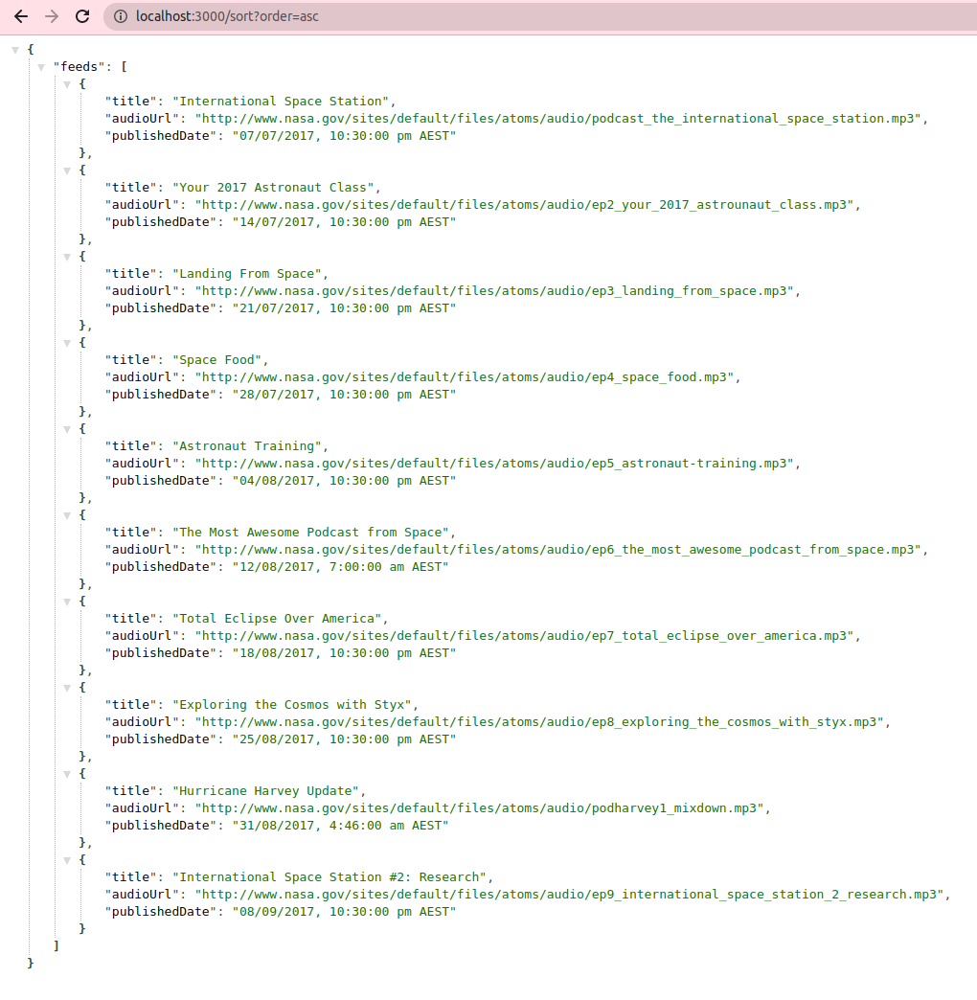
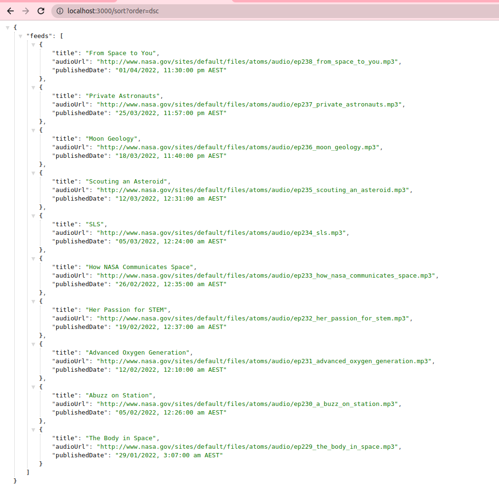

## Intro:
I have added a few testcases for rss-parser, but didn't spend any time writing testcases against the REST endpoints. 
Additionally haven't really mocked the XML output from the RSS feed; In an out of test scenario - one would use mocks and spys to mock the behaviour of a function or spy to inspect how it has been invoked.
see: https://pawelgrzybek.com/mocking-functions-and-modules-with-jest/




## Getting Started

- From the repo root folder run

```js
  npm install
  npm start
```

## How we are going to test your API
- We start your API locally by running the following:

```js
  npm install
  npm start
```

- Using Postman we will make a GET request to the following URL:

```
  http://localhost:3000/
```

- If the bonus round has been completed will make the following GET requests:

```
  http://localhost:3000/sort?order=asc
  http://localhost:3000/sort?order=dsc
```
